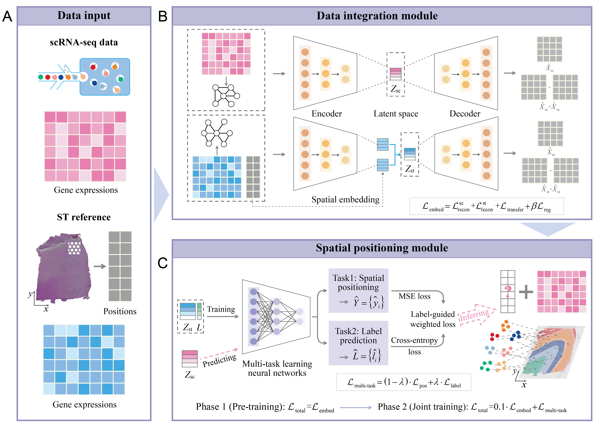

## A computing framework for spatial positioning of single-cell RNA sequencing data (CellPos)



Integrating single-cell resolution with spatial information is essential for understanding tissue architecture, development, and disease mechanisms. Empowering the vast existing single-cell RNA sequencing (scRNA-seq) datasets with spatial context can greatly enhance their interpretability and reuse potential. However, inferring the spatial origin of individual cells at single-cell resolution remains challenging. Here, we present CellPos, a method that enables spatial positioning for dissociated single cells by transferring spatial knowledge from spatial transcriptomics references. CellPos employs a dual-channel graph attention autoencoder to jointly embed transcriptional similarity and spatial neighborhood relationships, and leverages a multi-task learning strategy to simultaneously infer spatial coordinates and cell identities. The framework supports both single- and multi-reference settings, reducing biases from relying on a single reference. Across diverse species, tissues, and sequencing platforms, CellPos accurately captures fine-grained tissue structures and spatial distributions of cell types and marker genes, outperforming state-of-the-art methods. By restoring spatial context to scRNA-seq data, CellPos extends single-cell analysis beyond transcriptomics, thus enabling deeper exploration of tissue heterogeneity and cellular microenvironments.


## Dependencies and requirements 
### Create a CellPos environment
For CellPos, the Python version needs to be above 3.8, and it is recommended to create a new environment.
```bash
conda create -n cellpos-env python=3.8.0
conda activate cellpos-env 
```
### Install pytorch
The PyTorch version should be compatible with the CUDA version installed on your system. You can find the appropriate version on the PyTorch website.   
For example, here is one for CUDA 12.6:
```bash
pip3 install torch torchvision torchaudio
```
### Install CellPos
```bash
cd CellPos-master
python setup.py build
python setup.py install
```
### Install kernal
```bash
conda install ipykern
python -m ipykernel install --user --name cellpos-env --display-name "Python (cellpos-env)"
```
### Install other dependencies
numpy==1.23.5  
pandas==1.5.3  
anndata==0.9.2   
pytorch==2.4.1   
scikit-learn==1.3.0   
scanpy==1.9.8    
squidpy==1.2.2   
scanorama==1.7.4   
tqdm==4.65.0   
matplotlib==3.7.5  
seaborn==0.13.2   
## Tutorials
The following are detailed tutorials.   
1. CellPos is applied to [mouse embryo datasets](./tutorials/tutorials_Mouse_Embryo_E2z2.ipynb) to perform spatial positioning.   
2. CellPos is applied to [human DLPFC datasets](./tutorials/tutorials_Human_DLPFC_sample3_151674.ipynb) to perform spatial positioning.  
3. CellPos is applied to [mouse brain datasets](./tutorials/tutorials_Mouse_Brain_Coronal_MerFish_Ref_10X.ipynb) to perform spatial positioning.  


